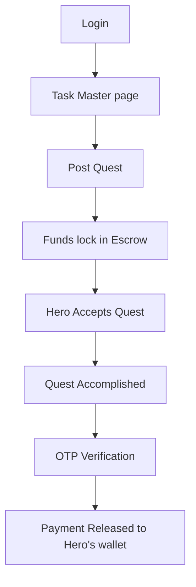
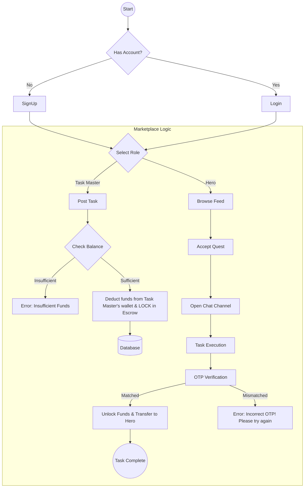
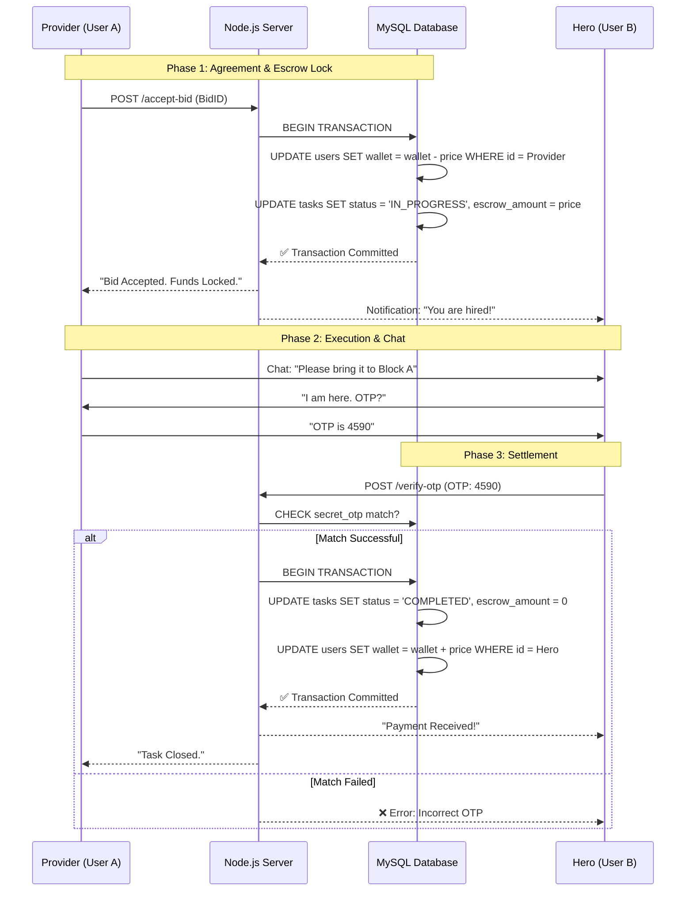
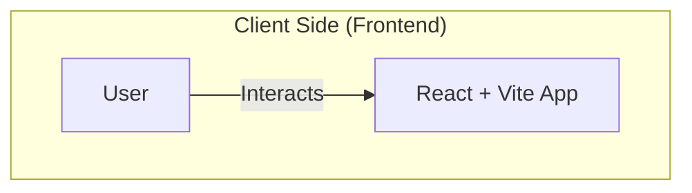
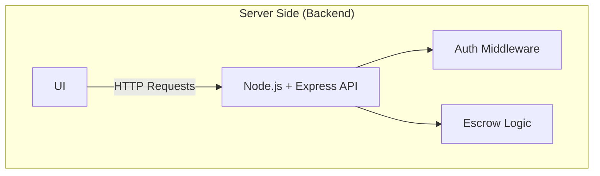
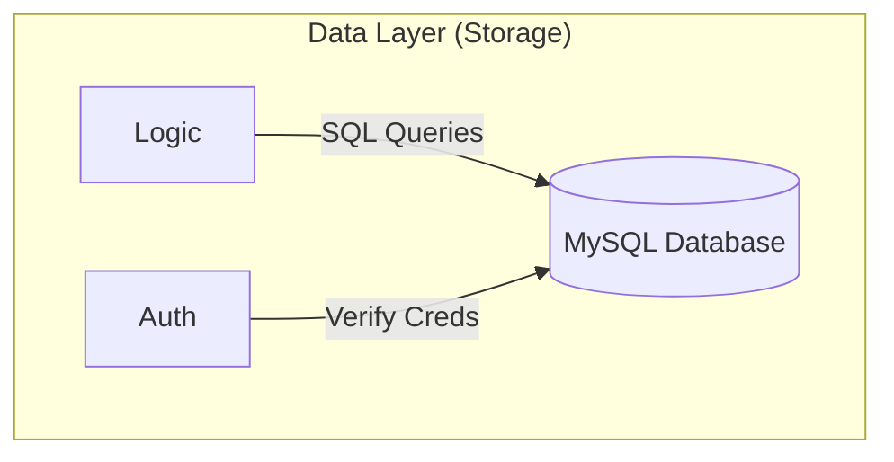

### ◆ User Journey
From posting a task to getting paid.

### ◆ Technical Workflow
The step-by-step process and logic is shown.

### ◆ Data Flow Diagram (DFD)
This sequence diagram details the Database Transactions. We use "Double-Entry" logic (Deduct first, Hold, then Release) to ensure money is never lost.

### ◆ System Architecture Diagram (High-Level)
This structural diagram shows how our Tech Stack components interact. We follow a standard **Client-Server Architecture**.

### ◆ Architecture Explanation
*We utilize a Client-Server Architecture with strict financial handling:*

**Presentation Layer**: React.js handles the UI, Chat interface, and state management.

**Application Layer**: Node.js/Express acts as the middleware. Crucially, it handles ACID Transactions for the wallet.

*Why*: If the server crashes after deducting money from the Provider but before assigning the Hero, the database transaction rolls back, ensuring no money is ever "lost" in the system.

**Data Layer**: MySQL stores relational data (Users, Tasks, Chat Logs) and the Escrow State.

**Escrow Logic**: Money does not go directly from A to B. It moves Provider -> Escrow Table -> Hero.
