#  Technical Architecture

### ◆ User Journey
From posting a task to the secure OTP handshake.

### ◆ Technical Workflow
The step-by-step process and logic is shown.

### ◆ Data Flow Diagram (DFD)
This sequence diagram details the Database Transactions. We use "Double-Entry" logic (Deduct first, Hold, then Release) to ensure money is never lost.

### ◆ System Architecture Diagram (High-Level)
This structural diagram shows how our Tech Stack components interact. We follow a standard **Client-Server Architecture**.

```mermaid
graph TD
    subgraph "Client Side (Frontend)"
        User[Student User]
        UI[React + Vite App]
        User -->|Interacts| UI
    end

    subgraph "Server Side (Backend)"
        API[Node.js + Express API]
        Auth[Auth Middleware]
        Logic[Escrow & OTP Logic]
        
        UI -->|HTTP Requests| API
        API --> Auth
        API --> Logic
    end

    subgraph "Data Layer"
        DB[(🍃 MongoDB)]
        
        Logic -->|Mongoose Queries| DB
        Auth -->|Find User Doc| DB
    end
```

