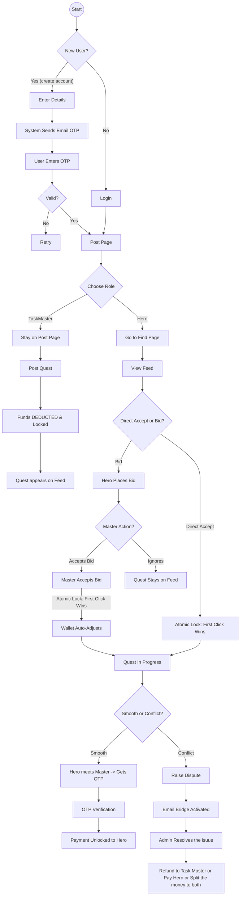
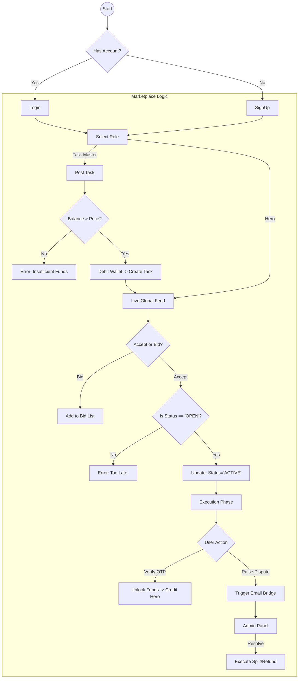

### ◆ User Journey
From posting a task to the secure OTP handshake.


### ◆ Technical Workflow
The step-by-step process and logic is shown.

### ◆ Data Flow Diagram (DFD)
This sequence diagram details the Database Transactions. We use "Double-Entry" logic (Deduct first, Hold, then Release) to ensure money is never lost.

```mermaid
sequenceDiagram
    participant TM as Task Master
    participant API as Node.js API
    participant DB as MongoDB
    participant H as Hero
    participant MAIL as Nodemailer

    Note over TM, DB: Phase 1: Creation & Bidding
    TM->>API: POST /create-task (Reward: ₹50)
    API->>DB: Debit ₹50 & Create { status: "OPEN" }
    
    alt Hero Bids Higher
        H->>API: POST /bid (Amount: ₹70)
        API->>DB: Push to Bids Array
        TM->>API: PUT /accept-bid
        API->>DB: Debit Extra ₹20 & Lock Task
    else Direct Accept (Race Condition Safe)
        H->>API: PUT /accept-task
        API->>DB: findOneAndUpdate({ _id: X, status: "OPEN" })
        alt Success (Lock Acquired)
             DB->>DB: Set AssignedTo = Hero
             API-->>H: "Quest Assigned!"
        else Fail (Already Taken)
             API-->>H: "Error: Quest no longer available"
        end
    end

    Note over H, DB: Phase 2: Execution & Disputes
    
    rect rgb(30, 30, 30)
        Note right of API: DISPUTE SCENARIO
        H->>API: POST /raise-dispute (Reason: "He ghosted me")
        API->>DB: Set Status="DISPUTED" (Lock Funds)
        API->>MAIL: Send Threaded Email (BCC Admin)
        MAIL-->>TM: "Reply with Proof"
        MAIL-->>H: "Reply with Proof"
        Note right of MAIL: Privacy: Emails are masked
    end

    Note over H, DB: Phase 3: Resolution
    
    alt Happy Path (OTP)
        H->>API: POST /verify-otp
        DB->>DB: Credit Hero & Close Task
    else Admin Resolution
        API->>DB: POST /resolve (Split 50/50)
        DB->>DB: Credit TM ₹35, Credit Hero ₹35
        DB->>DB: Close Task
    end
```

### ◆ System Architecture Diagram (High-Level)
This structural diagram shows how our Tech Stack components interact. We follow a standard **Client-Server Architecture**.

```mermaid
graph TD
    subgraph "Client Side (Frontend)"
        User[Student User]
        UI[React + Vite App]
        User -->|Interacts| UI
    end

    subgraph "Server Side (Backend)"
        API[Node.js + Express API]
        Auth[Auth Middleware]
        
        subgraph "Core Engines"
            Logic[Escrow & Rounding Logic]
            Race[Atomic Lock Manager]
            Dispute[Dispute Resolution Center]
        end
        
        UI -->|HTTP Requests| API
        API --> Auth
        API --> Logic
        API --> Race
        API --> Dispute
    end

    subgraph "External Services"
        Mail[Gmail SMTP Nodemailer]
        Dispute -->|Async Email| Mail
    end

    subgraph "Data Layer"
        DB[(🍃 MongoDB)]
        
        Logic -->|Transactions| DB
        Race -->|findOneAndUpdate| DB
    end
