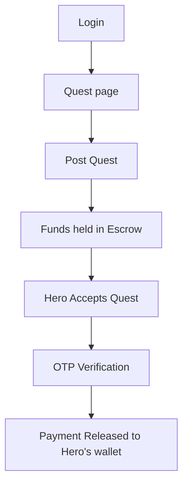
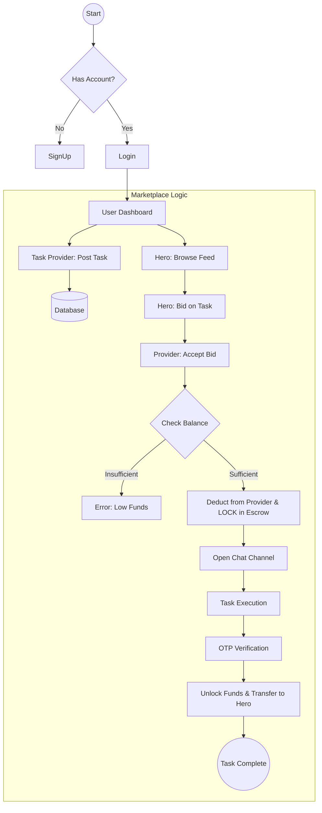
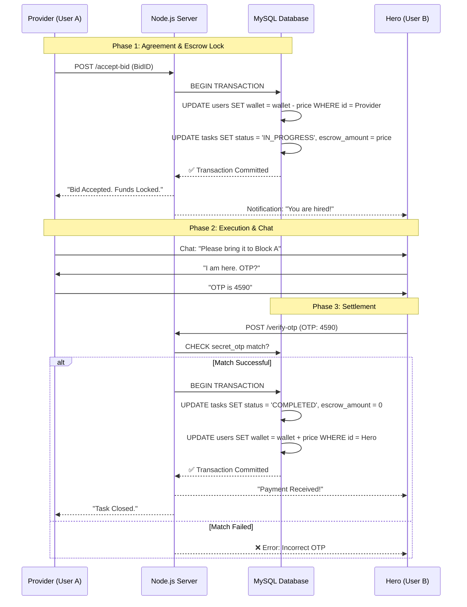
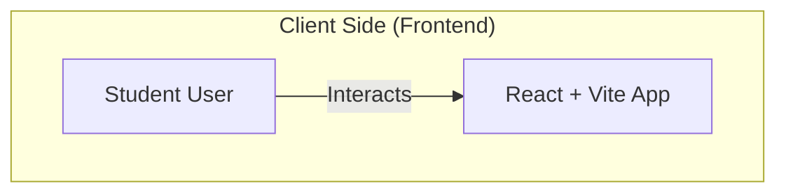
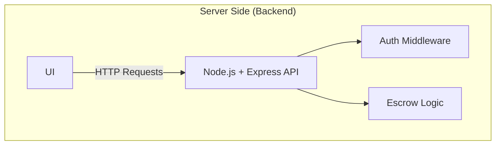

### ◆ User Journey
From posting a task to getting paid.


### ◆ Technical Workflow
The step-by-step process and logic is shown.

### ◆ Data Flow Diagram (DFD)
This sequence diagram details the Database Transactions. We use "Double-Entry" logic (Deduct first, Hold, then Release) to ensure money is never lost.

### ◆ System Architecture Diagram (High-Level)
This structural diagram shows how our Tech Stack components interact. We follow a standard **Client-Server Architecture**.



```mermaid
graph TD
    subgraph "Data Layer (Storage)"
        DB[(MySQL Database)]
        
        Logic -->|SQL Queries| DB
        Auth -->|Verify Creds| DB
    end
